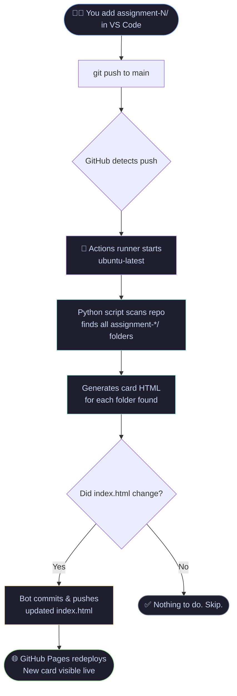
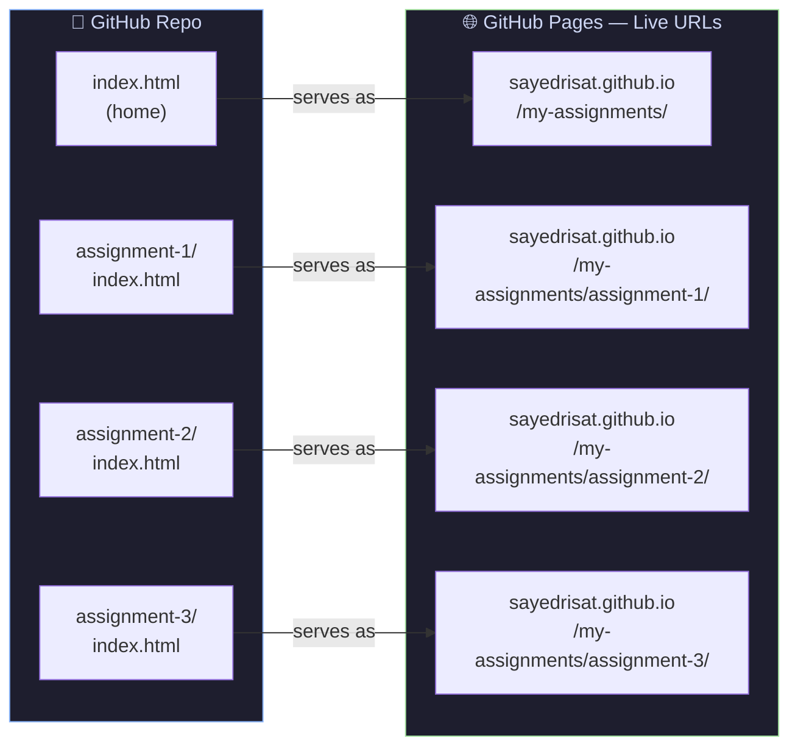
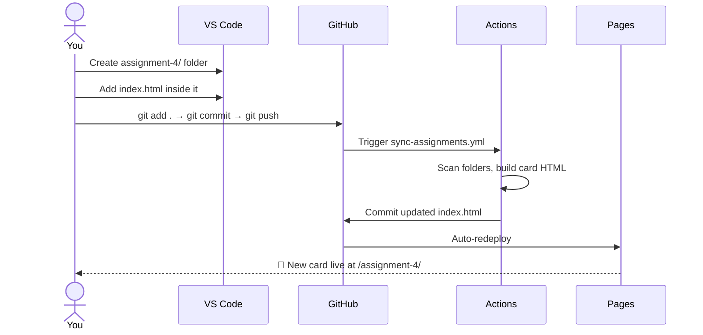
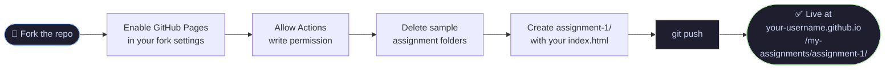

<div align="center">

# 📚 My Assignments

**A single GitHub repo — one live page per assignment, auto-synced.**

[](https://sayedrisat.github.io/my-assignments/)
[](https://github.com/sayedrisat/my-assignments/actions)
[](#-live-assignments)

<br/>

> Add a folder → push → done. The home page updates itself and a new live URL appears.

</div>

---

## 🗂️ Repo Structure

Every assignment lives in its own subfolder with its own files, completely independent of the others.

```
my-assignments/
│
├── index.html                  ← Home page (auto-updated, don't edit manually)
├── style.css                   ← Home page styles
├── README.md                   ← This file
│
├── .github/
│   └── workflows/
│       └── sync-assignments.yml   ← GitHub Actions automation
│
├── assignment-1/
│   ├── index.html
│   ├── style.css
│   └── script.js
│
├── assignment-2/
│   ├── index.html
│   ├── style.css
│   └── script.js
│
└── assignment-3/               ← Push this → live URL appears in ~30 sec
    ├── index.html
    └── ...
```

> **Rule:** Every `assignment-*/` folder **must** have its own `index.html` — otherwise GitHub Pages shows a 404.

---

## ⚙️ How the Automation Works

Push any change → GitHub Actions wakes up, scans all folders, rewrites `index.html`, and commits back — automatically.



---

## 🌐 How Each Assignment Gets Its Own Live URL

GitHub Pages mirrors the repo folder structure directly into live URLs — no config needed.



---

## ➕ How to Add a New Assignment

Three steps. No HTML editing. No config changes.



In short:

```bash
# 1. Create the folder and add your work
mkdir assignment-4
# ... add your index.html, style.css, etc.

# 2. Push it
git add .
git commit -m "add assignment 4"
git push

# 3. Wait ~30 seconds — done ✅
```

---

## 🔗 Live Assignments

| # | Assignment | Live URL |
|---|-----------|----------|
| 01 | Assignment 1 | [View Live →](https://sayedrisat.github.io/my-assignments/assignment-1/) |
| 02 | Assignment 2 | [View Live →](https://sayedrisat.github.io/my-assignments/assignment-2/) |
| 03 | Assignment 3 | [View Live →](https://sayedrisat.github.io/my-assignments/assignment-3/) |

> This table is updated manually. The home page cards update automatically.

---

## 🛠️ Setup (One-time)

If you fork this repo or set it up fresh:

**1. Enable GitHub Pages**
> Repo → Settings → Pages → Source: `Deploy from a branch` → Branch: `main` → Folder: `/ (root)`

**2. Allow Actions to push**
> Repo → Settings → Actions → General → Workflow permissions → **Read and write permissions** ✅

That's it. Everything else is automatic.

---

## 🎓 For Students — Use This as Your Own Assignment Hub

Want the same setup for your own coursework? You can copy this entire system in under 5 minutes.

### Step 1 — Fork this repo

Click the **Fork** button at the top-right of this page. This copies everything — the automation, the home page, the styles — into your own GitHub account.

```
github.com/sayedrisat/my-assignments  →  (Fork)  →  github.com/YOUR-USERNAME/my-assignments
```

### Step 2 — Enable GitHub Pages on your fork

> Your forked repo → **Settings** → **Pages**
> → Source: `Deploy from a branch`
> → Branch: `main` → Folder: `/ (root)`
> → Click **Save**

### Step 3 — Allow the bot to write to your repo

> Your forked repo → **Settings** → **Actions** → **General**
> → Workflow permissions → select **Read and write permissions** → **Save**

### Step 4 — Delete the existing assignment folders

The forked repo has `assignment-1/`, `assignment-2/` etc. from this repo. Delete them and start fresh with your own work.

```bash
git clone https://github.com/YOUR-USERNAME/my-assignments.git
cd my-assignments

# Remove sample assignments
rm -rf assignment-1 assignment-2 assignment-3

git add .
git commit -m "start fresh"
git push
```

### Step 5 — Submit your first assignment

```bash
# Create your assignment folder
mkdir assignment-1
cd assignment-1

# Add your HTML, CSS, JS files
# (Must have at least an index.html)

cd ..
git add .
git commit -m "add assignment 1"
git push
```

The home page card appears automatically. Your live URL will be:

```
https://YOUR-USERNAME.github.io/my-assignments/assignment-1/
```

---

### 🗺️ Student Workflow at a Glance



---

### ❓ Common Questions

**Q: Do I need to know GitHub Actions to use this?**
No. The automation is already set up. You just add folders and push.

**Q: Can I rename the assignment folders?**
The folders must start with `assignment-` (e.g. `assignment-1`, `assignment-2`). The number at the end determines the order on the home page.

**Q: What files do I need inside each assignment folder?**
At minimum, one `index.html`. You can also add `style.css`, `script.js`, images, or any other files your assignment needs.

**Q: My live page shows a 404. What's wrong?**
Make sure your assignment folder has an `index.html` directly inside it — not in a subfolder. GitHub Pages specifically looks for `index.html` to serve the page.

**Q: How long until my page goes live after pushing?**
Usually 20–40 seconds. You can watch the progress under the **Actions** tab of your repo.

**Q: Can I share my assignment link with my teacher?**
Yes — just share `https://YOUR-USERNAME.github.io/my-assignments/assignment-N/` directly. No login required to view it.

---

<div align="center">

Made with 🖤 by [Sayed Risat](https://github.com/sayedrisat)

</div>
